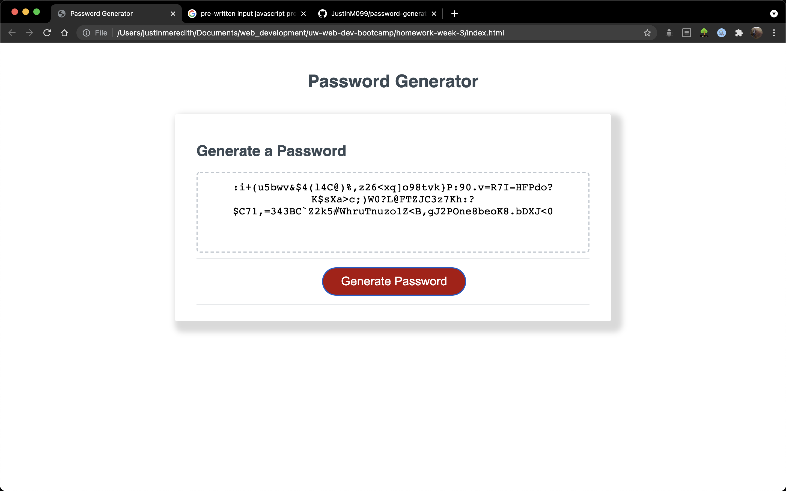

This is a password generator application.
When the website is loaded, the user is given a series of prompts about the size of their password
and what characters should be included.
After user input is taken, the user can then click on a button that will generate a custom password
based on their inputs.
The user may click this button as many times as they like, and a new, random password will be generated
each time.

Here's a screenshot:

Here's a link to the deployed site:
https://justinm099.github.io/password-generator/

Please feel free to reach out with questions!
justinm099@mac.com
